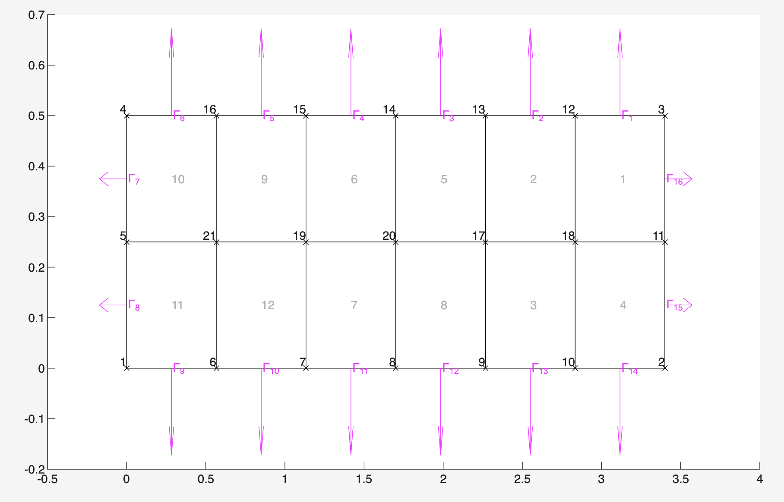
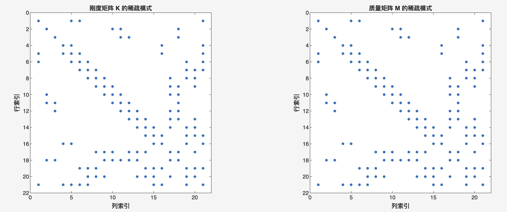
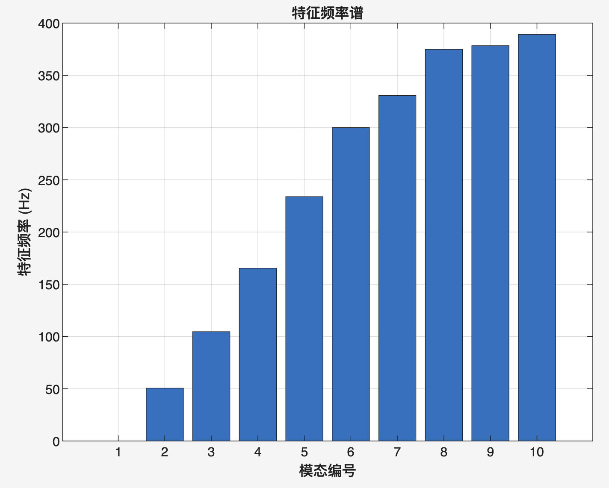
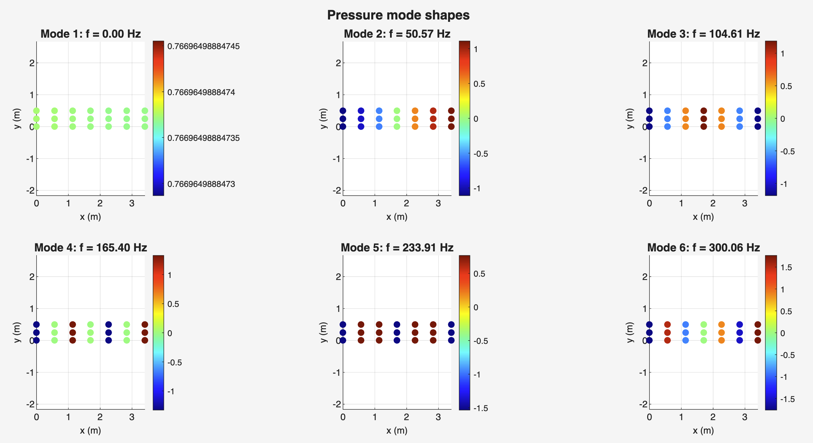
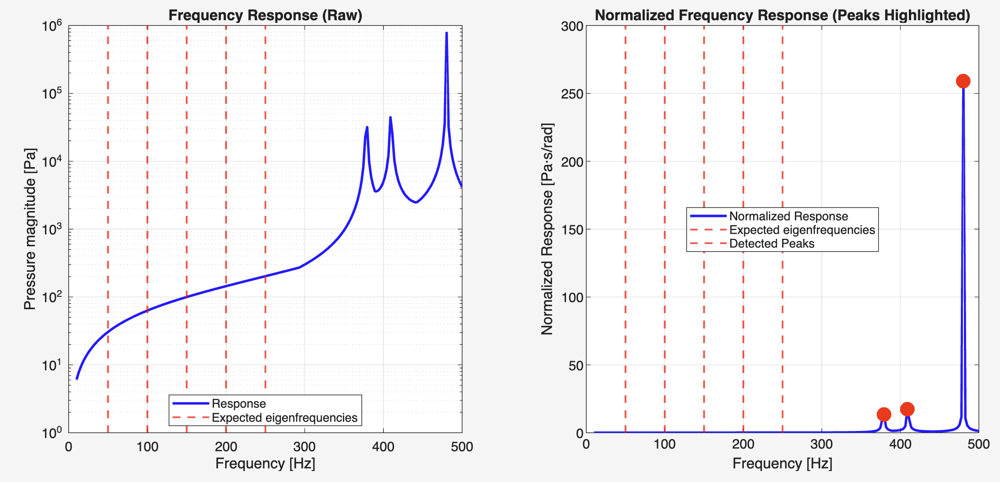
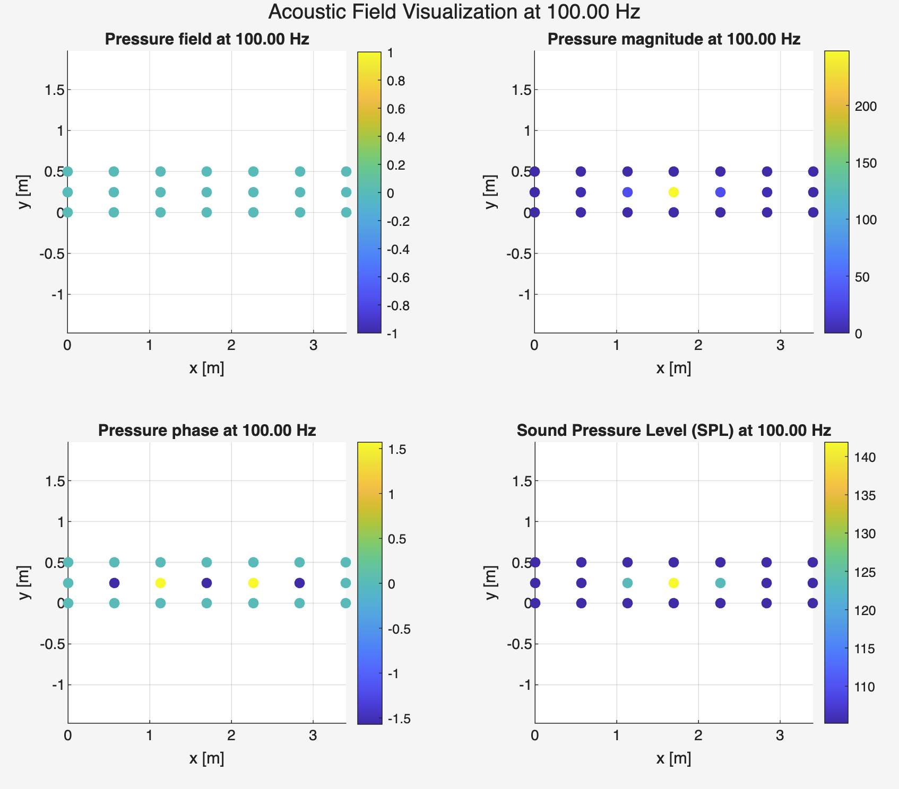
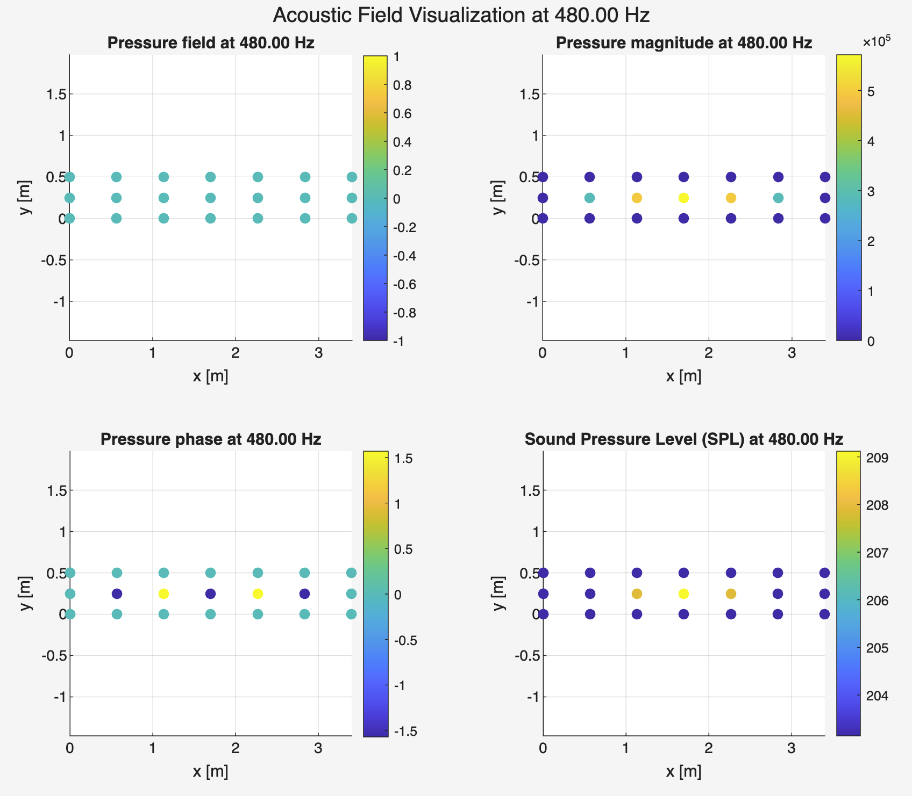

# FEM 声学有限元求解器（FEM-acoustic-solver）

**FEM-acoustic-solver** — 基于 MATLAB 的轻量级有限元管线：在 Gmsh 剖分的二维网格上求解声学 **Helmholtz 方程**与**广义特征值问题**，适用于管道、腔体等二维声学模型的模态与谐波分析。

---

## 项目简介（Overview）

本项目提供**从 `.msh` 网格到声压场与频谱**的完整流程：

- **网格与边界**：读入 Gmsh 网格（`msh2mat`），识别边界节点与物理边（`getBoundary`），用于施加 Dirichlet / Neumann 等声学边界条件。
- **全局矩阵**：用标准形函数与高斯积分组装**刚度矩阵 `K`**（梯度项）与**质量矩阵 `M`**（质量项），得到稀疏结构一致的有限元系统。
- **模态分析**：求解 $\mathbf{K}\boldsymbol{\phi} = k^2 \mathbf{M}\boldsymbol{\phi}$，输出各阶固有频率与压力振型。
- **频域谐波分析**：在点声源激励下求解 $(\mathbf{K} - k^2\mathbf{M})\mathbf{p} = \mathbf{f}$，扫频得到频响，并在指定频率下可视化声压幅值、相位与 SPL。默认脚本 `run_frequency_response.m` 将**目标位置**设为 $[1.7,\,0]\,\mathrm{m}$（约沿管长方向中部），在**排除边界节点**后取与该目标最近的**内部节点**施加体积速度载荷（`addAcousticSource`），因此声源在**计算域内部**，不在网格外「域外」；若最近节点落在边界上会触发警告。

默认演示采用 **`mesh/duct/`** 管道算例（如 `duct4l.msh`）：矩形截面、硬壁边界与上述内部点源，便于观察纵模共振与近共振频率下的强响应。仓库内另有 **`mesh/2D/`** 多种几何，可在入口脚本中替换 `file.mesh` 做扩展实验。

**duct 算例 — 计算网格与边界标记**（节点编号、单元编号与边界段 $\Gamma_i$ 示意）：



---

## 方法与实现（Methods）

### 控制方程（频域 Helmholtz）

无源区域内时谐声压幅值 $p$ 满足：

$$\nabla^2 p + k^2 p = 0,\quad k = \omega/c .$$

伽辽金弱式离散后得到代数形式：

$$(\mathbf{K} - k^2 \mathbf{M})\mathbf{p} = \mathbf{f},$$

其中 $\mathbf{K}$ 对应 $\int \nabla N_a \cdot \nabla N_b \,\mathrm{d}\Omega$，$\mathbf{M}$ 对应 $\int N_a N_b \,\mathrm{d}\Omega$（实现见 `computeElementMatrices.m`）。

### 模态分析

齐次问题退化为广义特征值问题：

$$\mathbf{K}\boldsymbol{\phi} = k^2 \mathbf{M}\boldsymbol{\phi},$$

由 $k$ 与声速 $c$ 得固有频率 $f = k c / (2\pi)$（`solveEigenvalueProblem.m`）。

**全局矩阵稀疏结构**：组装后的 $\mathbf{K}$、$\mathbf{M}$ 为稀疏矩阵；下图用 `spy` 展示非零元分布（同一连通模式下两矩阵结构一致）。



**特征频率与振型**：下左为各阶模态对应的**特征频率（Hz）**柱状图；下右为前几阶**压力模态振型**在采样点上的分布（离散展示）。

| 特征频率谱 | 压力模态振型（前若干阶） |
|:---:|:---:|
|  |  |

### 边界条件与激励

- **硬边界**：Dirichlet $p=0$（`applyBoundaryConditions.m`，类型 `'hard'`）。
- **软边界**：Neumann 自然边界（`'soft'`）。
- **点声源**：载荷向量在最近内部节点上施加（`addAcousticSource.m`），强度与 $\rho,\omega,Q$ 相关。

### 单元与数值积分

支持 Gmsh **线单元**与**四边形单元**（`shapeFunctions.m`、`computeJacobian.m`）；单元矩阵通过高斯积分组装（`assembleGlobalMatrices.m`）。

### 频响与谐波声场

`computeFrequencyResponse` 在频率范围内逐点求解线性系统；`visualizeAcousticField` 等函数在给定频率下绘制**声压实部/幅值/相位**与 **SPL**。下图左为原始幅值（对数纵轴）与“预期特征频率”竖线对比，右为归一化频响与峰值标注——可用于对照模态频率与响应峰位。



在 **100 Hz** 与 **480 Hz** 下的声场示例（四宫格：声压、幅值、相位、SPL；采样点为离散网格点）。480 Hz 附近易出现强峰，幅值与 SPL 色标与 100 Hz 工况量级不同。

| 100 Hz 声场 | 480 Hz 声场 |
|:---:|:---:|
|  |  |

---

## 性能分析（Performance）

以下为**算法与实现**层面的可观测指标；具体耗时与机器、MATLAB 版本及自由度规模有关。

| 环节 | 说明 |
|------|------|
| **组装** | `assembleGlobalMatrices` 对每个单元调用 `computeElementMatrices`，复杂度约 **$O(N_{\mathrm{el}})$**；入口脚本打印 `tic/toc` 与 $\mathbf{K},\mathbf{M}$ 尺寸。 |
| **稀疏度** | `run_eigen_modes.m` 可输出 `nnz(K)`、`nnz(M)` 占满阵比例，用于估计存储与求解成本。 |
| **特征求解** | `solveEigenvalueProblem` 优先 `eigs(K,M,...,'smallestabs')`；失败时回退 `eig(full(K),full(M))`（**仅适用于小规模**）。 |
| **频扫** | `computeFrequencyResponse` 对每个频率构造 $\mathbf{A}=\mathbf{K}-k^2\mathbf{M}$ 并求解，复杂度约 **$O(N_{\mathrm{freq}} \cdot \mathrm{cost}(\mathbf{A}^{-1}\mathbf{f}))$**。 |

**duct 默认网格**（`duct4l.msh`）自由度适中，适合作为桌面演示；更细网格或大规模二维问题应选用合适的稀疏直接法/迭代法并关注内存。

---

## 代码链（Code Chain）

从数据到结果的主路径如下（与仓库目录对应）：

```text
Gmsh .msh
    │
    ▼
msh2mat.m                    % 节点、单元、类型、DOF 映射
    │
    ▼
getBoundary.m                % 边界节点/边（BC 与后处理）
    │
    ├──────────────────────────────────────────────┐
    ▼                                              ▼
computeElementMatrices.m  ◄── shapeFunctions / computeJacobian
    │
    ▼
assembleGlobalMatrices.m        →  K , M
    │
    ├──────────────────────► applyBoundaryConditions.m（可选）
    │
    ├──────────────────────► solveEigenvalueProblem.m     → 模态频率 / 振型
    │
    └──────────────────────► computeFrequencyResponse.m
                 ▲                    │
                 │              addAcousticSource.m
                 │                    │
                 │                    ▼
                 │              solveLinearSystem.m  →  p(ω)
                 │                    │
                 │                    ▼
                 └──────────  computeAcousticQuantities.m / visualizeAcousticField.m
```

**入口脚本（用户层）**

| 文件 | 作用 |
|------|------|
| `preview_mesh.m` | 网格预览（`plotMesh`） |
| `run_eigen_modes.m` | 雅可比检查 → 组装 → 模态 → 振型与频谱图 |
| `run_frequency_response.m` | 边界条件 → 频扫频响 → 多频谐波场与 SPL |

**物理常数**：`functions/config.m`（如 `air.c`、`air.rho`）。

---

## 目录结构

```text
FEM-acoustic-solver/
├── README.md
├── preview_mesh.m
├── run_eigen_modes.m
├── run_frequency_response.m
├── duct算例结果图/          % duct 算例结果截图（与默认脚本一致）
├── functions/               % 核心算法
└── mesh/
    ├── duct/                % 管道算例 .msh
    └── 2D/                  % 更多二维几何
```

---

## 环境依赖与运行

- **MATLAB**（建议 R2018b 及以上；需 `eigs`、稀疏线性代数与常用绘图功能）。
- 在**仓库根目录**执行：

```matlab
preview_mesh              % 网格预览
run_eigen_modes           % 模态分析
run_frequency_response    % 频响 + 声场
```

修改各脚本中的 `file.mesh` 可切换网格；物理常数在 `functions/config.m` 中统一修改。

